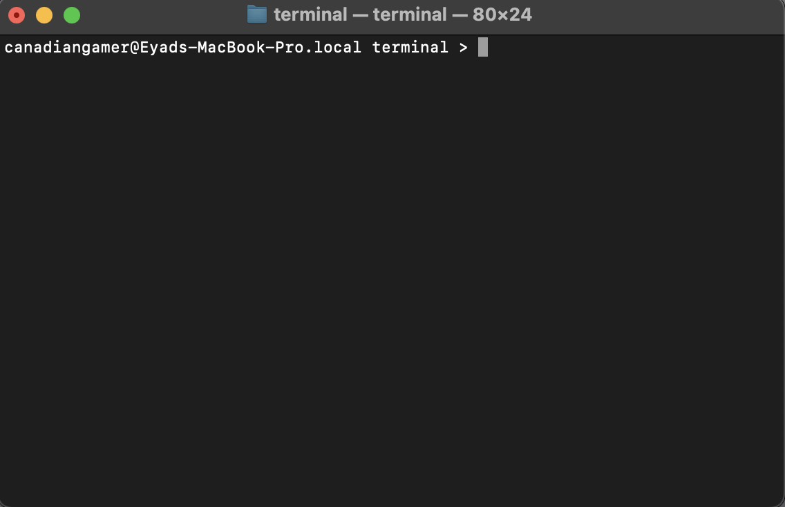

# Rust Terminal

This application is a Terminal made with Rust. Right now its a simple application, and eventually going to add a gui to this terminal but for now its runs for Mac and it can only be runned through the normal terminal. Once I add a gui to it, gonna add a windows version for it.

## Commands:

As for commands here is the list, of the commands that are currently in the terminal.
Available commands:
help - shows the list of commandss
hello      - Greets the user.
date       - Shows the current date.
time       - Shows the current time.
clear      - Clears the screen.
pwd        - Prints the current working directory.
ls         - Lists files in the current directory.
whoami     - Displays the current username.
echo [msg] - Displays the message entered.
cat [file] - Displays the contents of a file.
touch [file] - Creates an empty file.
rm [file]  - Deletes the specified file.
write [file]  - Write in the specified file if it exists, if not create a new file.
cd [dir]   - Changes the current directory.
exit       - Exits the terminal.

## Screenshots

This is the terminal being runned on my macbook, its very similar to the the macbook zsh terminal, but it has a .local which I will fix.

